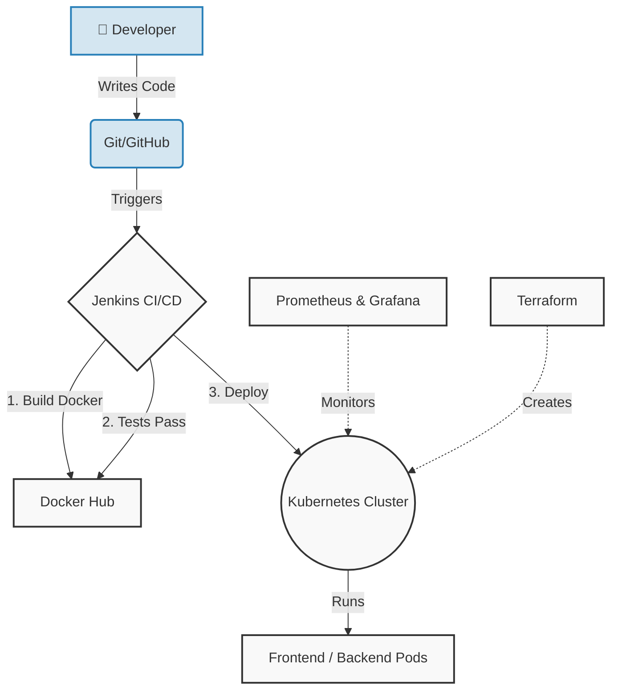
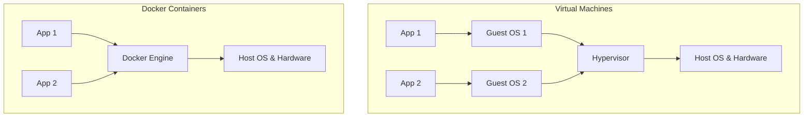
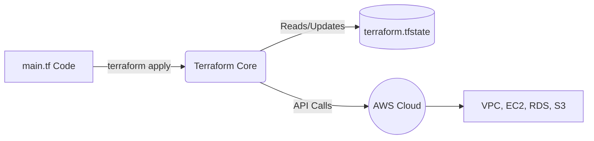
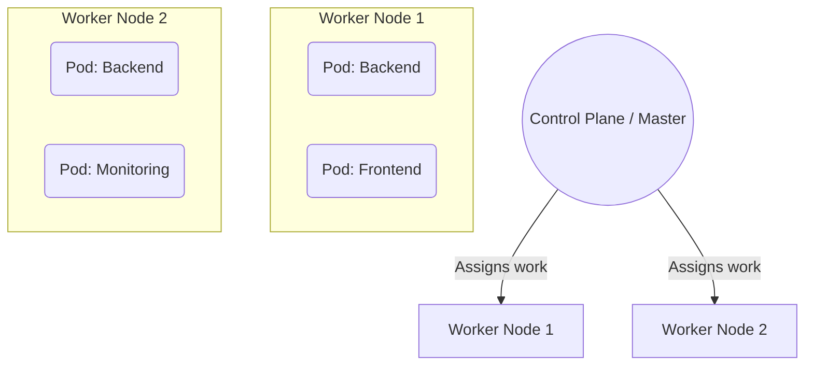
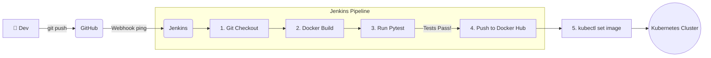
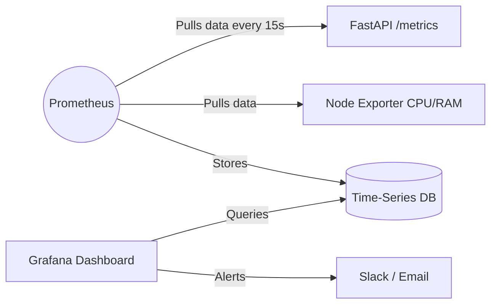
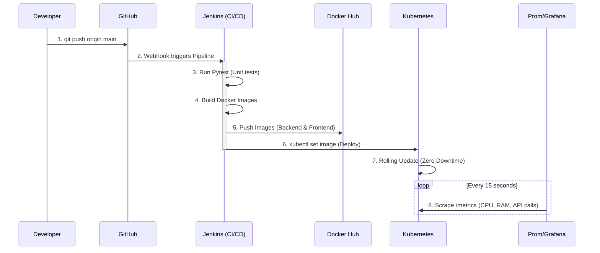

# 🚀 EmergencyQ — DevOps & Cloud Pipeline Explained (Deep Dive)

> Yeh document tujhe **ekdum seedha-seedha** samjhayega ki **kyun**, **kya**, **kaise** aur **kis order mein** ye saari tools lagani hai. Saath hi, isme **conceptual depth** aur **diagrams** hain taaki tere dimaag mein ekdum clear picture ban jaaye. Padh le, samajh aa jayega, aur kisi ko bhi easily explain kar payega.

---

## 🎯 1. The Big Picture — Pehle Ye Samajh

Abhi tera project aise chalta hai:

```text
Tere Laptop pe:
  Terminal 1 → uvicorn app.main:app (backend)
  Terminal 2 → npm run dev           (frontend)
  
  Bas tu aur tera laptop. That's it.
```

**Problem kya hai? (The "It works on my machine" syndrome)**
- Sirf TERE laptop pe chalta hai. Agar tera code AWS server pe daala, shayad error de de (version mismatch).
- Dusre developer ko dena ho to poora setup karna padega (Python install, node install, DB setup).
- Agar server crash hua → tera app band. Tujhe aake restart karna padega.
- Traffic 10x ho gaya → server hang. Tujhe naya server manually banana padega.
- Kitne log use kar rahe hain, kya error aa rahi hai → kuch pata nahi.

**Solution → The DevOps Pipeline:**
DevOps ek process hai jisme development aur operations jud jaate hain taaki sab kuch **Automated**, **Reliable**, aur **Scalable** ho.



---

## 🧠 2. Simple Analogy — Biryani Wali

Ek deep analogy se poora DevOps samajhte hain:

| DevOps Tool | Biryani Analogy | Tech Concept |
|-------------|----------------|--------------|
| **Git/GitHub** | Teri recipe diary jo sab dekh sakte hain. | Source Code Management. Single source of truth. |
| **Docker** | Ek special tiffin box (dabba) jisme biryani, raita aur chammach sab packed hai. Kahi bhi le jao, kholo aur khao. | Containerization. Packages code + dependencies so it runs anywhere identically. |
| **Terraform** | Ek building contractor jisko tu naksha (code) deta hai, aur wo kitchen (server) bana deta hai. | Infrastructure as Code (IaC). Declarative setup of cloud resources. |
| **Kubernetes (K8s)**| Kitchen ka Head Chef/Manager. Ye dekhta hai ki 10 log khane aaye to 2 box kholo, 100 aaye to 20 box kholo. Agar ek box kharab nikla to use phek ke naya laao. | Container Orchestration. Auto-scaling, self-healing, load balancing. |
| **Jenkins** | Kitchen ka automated robot. Jaise hi nayi recipe aayi, ye khud test karega, dabba pack karega aur chef ko de dega. | Continuous Integration / Continuous Deployment (CI/CD pipeline). |
| **Prometheus** | Kitchen ka inspector jo har 15 sec mein check karta hai ki "gas ka pressure theek hai? kitni biryani biki?" | Metrics Collector (Time Series Database). |
| **Grafana** | Ek bada TV screen jisme inspector ka data charts mein dikhta hai. | Data Visualization & Alerting. |

---

## 📦 3. Tool 1 — DOCKER (The Dabba)

### Kyun Chahiye?
**Problem:** VM (Virtual Machine) bhot heavy hoti hai. Har VM ka apna Operating System hota hai (10 GB+). Ek server pe 4 VM chalana mushkil hai.
**Solution:** Docker containers VMs nahi hote. Ye OS ka base share karte hain, isliye bhot light (MBs mein) aur fast (seconds mein start) hote hain.



*Concept Depth:* Docker under the hood Linux ke `cgroups` (CPU/RAM limit karta hai) aur `namespaces` (Process isolation deta hai) use karta hai. Isliye tere app ko lagta hai ki wo akela chal raha hai.

### Kya banega?
Tera app + requirement.txt + python = **1 Docker Image**.

**Ek command (docker-compose up):**
Ye command `docker-compose.yml` padhti hai aur Backend, Frontend, aur Monitoring sab ek saath utha deti hai tera local test ke liye.

---

## ☁️ 4. Tool 2 — TERRAFORM (The Builder)

### Kyun Chahiye?
**Problem:** Cloud (AWS) pe jaake manually VPC, Security Group, EC2 banayenge. Kal ko dubara banana pada (ya destroy karna pada) to click-click mein error hogi.
**Solution:** **Infrastructure as Code (IaC)**. Terraform ko ek `main.tf` file de do, wo AWS ko API calls karke sab automatically bana dega.

### Concept Depth: Declarative vs Imperative & State File
Terraform **Declarative** hai. Matab tu use ye nahi bolta ki *"Pehle EC2 banao, phir Security group banao"*. Tu bas usko "Final Result" (State) batata hai: *"Mujhe 1 EC2 aur 1 SG chahiye"*. Terraform khud decide karta hai kaise banana hai.

**State File (`terraform.tfstate`):** Ye Terraform ki memory hai. Isme likha hota hai ki pichli baar kya banaya tha. Jab tu dubara code run karta hai, wo check karta hai: *"Achha, 1 server ban chuka hai, ab inko database bhi chahiye, to sirf DB banaunga"*.



---

## ⎈ 5. Tool 3 — KUBERNETES / K8s (The Manager)

### Kyun Chahiye?
**Problem:** Docker dabba bana deta hai. Par production mein agar 10 dabbe (containers) chalane hain 3 alag-alag machines pe, to unhe manage kaun karega? Agar Machine 1 band ho gayi, to uspe chal rahe dabbon ka kya hoga?
**Solution:** Kubernetes. Ye ek poori "Fleet Management" system hai.

### Concept Depth: Control Plane vs Worker Nodes
K8s mein do main cheezein hoti hain:
1. **Control Plane (The Mastermind):** Isme `kube-apiserver` aur `etcd` hota hai. Ye decide karta hai ki kaunsa dabba kahan chalega.
2. **Worker Nodes (The Labor):** Ye actual servers hain jahan tere Docker containers (K8s ki bhasha mein **Pods**) chalte hain.



**Kubernetes ke Superpowers:**
- **Self-Healing:** Agar Backend Pod crash hua, Master turant naya bana dega bina tujhe disturb kiye.
- **Auto-Scaling:** Agar CPU usage 80% cross kiya, Master apne aap 2 naye Backend Pods chalu kar dega (Horizontal Pod Autoscaler).
- **Zero-Downtime Deploy (Rolling Update):** Jab naya version aata hai, purane pods ek saath nahi marte. Pehle 1 naya banta hai, phir 1 purana marta hai. Taaki users ko kabhi website "Down" na dikhe.

---

## 🔄 6. Tool 4 — JENKINS (The Robot Worker)

### Kyun Chahiye?
**Problem:** Code update karne ke baad manually test run karna, Docker build karna, aur Kubernetes pe kubectl command chalana bhot thakau aur error-prone hai.
**Solution:** CI/CD (Continuous Integration / Continuous Deployment).

### Concept Depth: The Webhook Magic
Jaise hi tu `git push` karta hai, GitHub ek **Webhook** (ek invisible HTTP call) bhejta hai Jenkins ko: *"Bhai, naya code aaya hai, uth ja!"*.


*Pipeline Code (Jenkinsfile) ek script hoti hai jo ye steps sequentially run karti hai. Agar Step 3 (Tests) mein error aayi, to Step 4 aur 5 nahi chalenge. (Broken code production mein nahi jayega).*

---

## 📊 7. Tool 5 — PROMETHEUS + GRAFANA (The Eyes)

### Kyun Chahiye?
**Problem:** K8s aur Docker apna kaam kar rahe hain, par system ki health kya hai? Models load hone mein kitna time lag raha hai?
**Solution:** Observability (Monitoring).

### Concept Depth: Pull vs Push Mechanism
Jyada tar monitoring systems "Push" based hote hain (App khud data bhejta hai).
**Prometheus "Pull" based hai.** Prometheus ek Watchman ki tarah tere backend ke `/metrics` endpoint (url) pe jaata hai aur har 15 second mein data **kheench (pull)** ke lata hai.
Iska fayda? Agar tera backend mar gaya, to wo data push nahi kar payega aur system ko pata bhi nahi chalega. Prometheus pull karta hai, to agar backend ne response nahi diya, Prometheus turant samajh jata hai ki "App is DOWN!".



---

## 🔁 8. COMPLETE WORKFLOW — The EmergencyQ Cycle

Ab is pure system ko ek saath dekho. Ye tera ultimate CI/CD/Cloud workflow hai:



---

## 📋 9. Implementation Order — Kya Pehle, Kya Baad Mein

> [!IMPORTANT]
> Is order ko religiously follow kar. DevOps step-by-step game hai:

| Step | Tool | Goal |
|------|------|------|
| **1** | **Docker** | Sabka base hai. Pehle apne code ko containerize kar (`Dockerfile`). |
| **2** | **Docker Compose** | Local pe sab ek saath chalane ke liye `docker-compose.yml` bana. |
| **3** | **Prometheus + Grafana** | Local Docker setup mein monitoring add kar. |
| **4** | **Terraform** | Ab Cloud pe ja. `main.tf` likh aur AWS pe VPC/EC2 infrastructure bana. |
| **5** | **Kubernetes** | Un Cloud servers pe K8s install kar aur `.yaml` deploy kar. |
| **6** | **Jenkins** | Last step automation hai. Push pe pipeline trigger karne ka setup bana. |

---

## ❓ 10. Common Interview/Viva Questions (Level-Up)

| Question | Deep Answer |
|----------|-------------|
| **Why not just Docker? Why K8s?** | Docker ek engine hai jo containers chalata hai. Agar container fail hua, ya 5 server pe chalana ho, Docker native cluster manage nahi kar sakta. K8s orchestrator hai jo auto-scaling aur high-availability (self-healing) provide karta hai. |
| **Terraform vs AWS Management Console?** | Console manual hai, history nahi rehti. Terraform version-controlled (Git) hai. State file ki wajah se ise pata hota hai ki current cloud infra kaisa dikhta hai, aur kya update karna hai. |
| **What happens if a K8s Pod crashes?** | K8s ka `ReplicaSet` controller dekhta hai ki desired state (e.g. 2 replicas) meet ho rahi hai ya nahi. Agar 1 pod crash hua, wo turant Master API ko report karta hai aur naya pod schedule kar deta hai. |
| **Why Prometheus over CloudWatch?** | CloudWatch AWS specific hai. Prometheus cloud-agnostic hai, pull-based hai, aur K8s ecosystem ke liye native standard hai (isliye Grafana ke saath perfectly integrate hota hai). |
| **What is Rolling Update in Jenkins/K8s?** | Deployment strategy jahan purane containers ek-ek karke replace hote hain. User ko kabhi 404 Error nahi aati kyunki at least ek container hamesha traffic serve kar raha hota hai. |

---
**Summary:**
DevOps koi ek tool nahi hai, ek **philosophy** hai. Is pipeline ka maqsad ye hai ki tera focus sirf **EmergencyQ ka Code/ML Models likhne par ho**, baaki deployment, scaling aur recovery **machine khud sambhale**! 🎉
